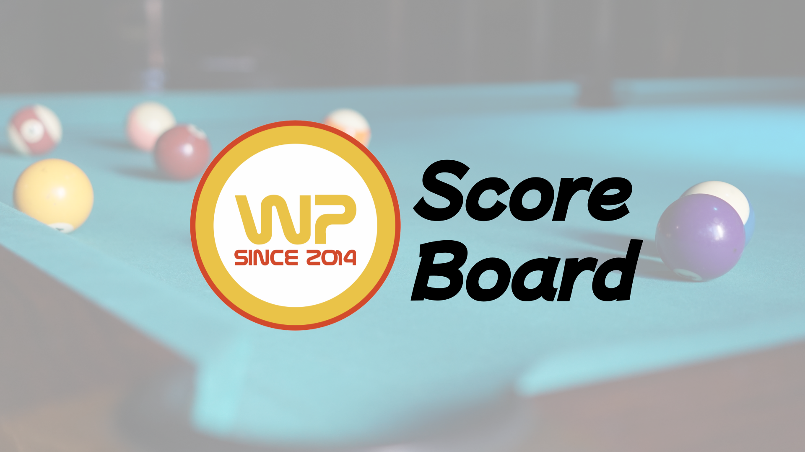
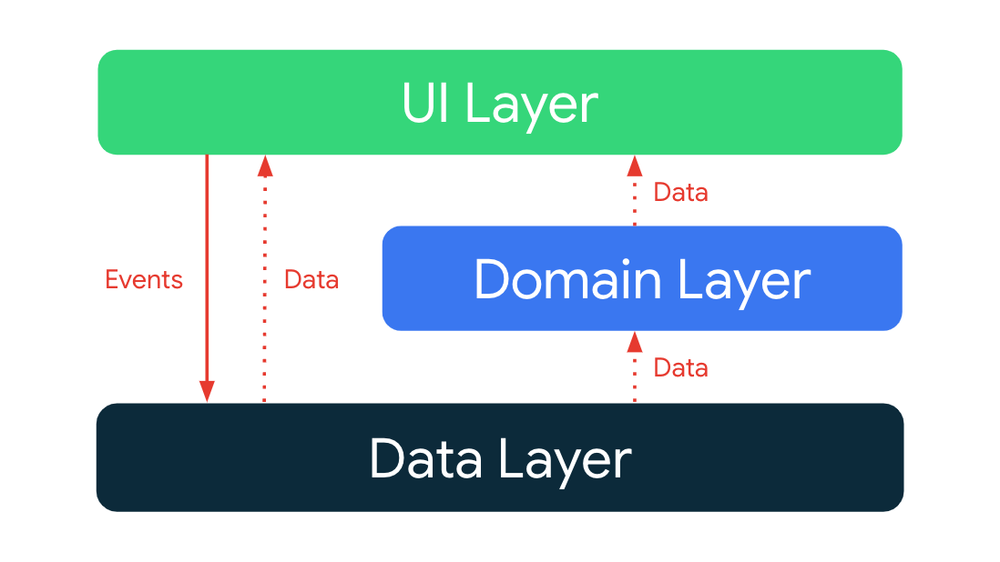

# WithPool-ScoreBoard

## 💡 Topic
- **활동중인 포켓볼 동호회를 위한 오프라인 태블릿 스코어보드 App**

## 🏆 Result
- 회원간 경기 기록을 DB에 집계하고, 해당 통계를 이용한 이벤트를 진행하여 월간 정기 모임 회원 참여도 약 90% 증가
- 동호회원 52명 투표 결과 스코어보드 앱 사용 만족도 평가 4.6점을 기록

## ❓ Why
- 현재 활동 중인 포켓볼 동호회에서는 아날로그 종이식 스코어보드를 사용하고 있어 많은 회원들이 불편을 느끼고 있었습니다.
- 저희 동호회는 활성 회원이 60명이고, 회원 전용 당구장을 운영하며, 월 평균 약 400경기가 진행되는 꽤 큰 규모의 동호회입니다.
- 그럼에도 불구하고, 게임 중 가장 자주 사용되는 스코어보드가 불편하다는 문제점이 있었습니다.

## 🛠️ How
- **원터치 방식의 디지털 스코어 보드 앱 개발**
  - 한 장씩 종이를 넘기던 아날로그 스코어보드의 불편함을 원터치 방식으로 개선
- **경기 종료 후 경기 기록 저장**
  - Firebase Firestore 내 회원간 경기 기록을 저장하여, 월 평균 400 경기 기록을 계속하여 집계하고 있음
  - 운영진으로서 해당 통계를 활용하여, 분기와 반기별 이벤트 및 리그전을 총 5회 성공적으로 진행

## 🤚🏻 Role and Responsibilities

1. 전체 프로젝트 기획 및 제안
2. 안드로이드 앱 설계 및 개발
3. 프로젝트 예산 확보 및 충전기 및 테블릿 구매
4. 각 당구대마다 설치 및 사용 가이드 제작하여 책임적으로 프로젝트 완수

## ⚙️ Architecture Pattern

Model - View - ViewModel

## 💻 Tech

- **Kotlin**
- **MVVM** Architecture Pattern
- **`Hilt`** 의존성 주입을 위한
- **`DataBinding`**
- **`GraphQL`** 의 동작 원리를 알고, 안드로이드에서의 **`GraphQL` 호출 및 응답 방법**을 알게 됐음.
- **`ExoPlayer`** , `MediaPlayer` 와 **`AudioRecorder`** 사용법과, **`AudioEffect`** 적용 방법을 알게 됐음.
- `CustomView` 를 직접 만들고 적용하는 방법을 알게 됐음. (녹음 실시간 오디오 웨이브 효과)
- `BaseActivity`, `BaseViewModel` 등의 패턴을 적용하여 **재사용성**을 높이기 위한 고민을 해볼 수 있었음.
- **`Event` Wrapper** 를 활용하여 효율적으로 View 에서 `LiveData` 를 다루는 법을 공부해볼 수 있었음.
- **Jira, Confluence 등의 협업 툴**을 사용해보았고 **애자일 방법론**을 도입하여 프로젝트를 진행할 수 있었음.
- KPT 회고를 도입하여 문제를 개선해나가며 스프린트, 스크럼을 이어나갈 수 있었음.

# 📷 Screenshot